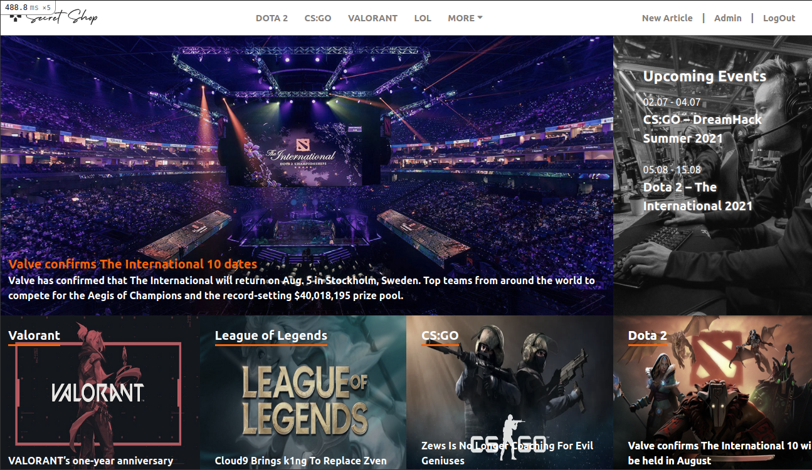
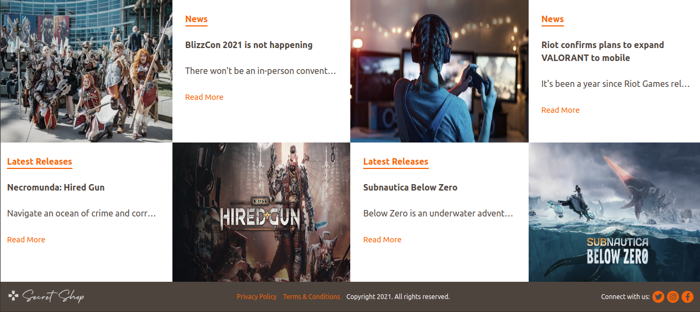

<p align="center">
  <a href="https://www.microverse.org/">
    
  </a>
  <a href="https://github.com/VanessaAoki/ror-social-scaffold/blob/main/LICENSE">
    
  </a>
  <a href="https://github.com/VanessaAoki/secret-shop">
    
  </a>
  <a href="https://github.com/VanessaAoki/secret-shop">
    
  </a>
  <a href="https://github.com/VanessaAoki">
    
  </a>
</p>

# Secret Shop
Secret shop is a gaming/esports articles blog, that features News, Patch Notes, Game Releases, Upcoming Events, as well as articles for the most popular games, such as CS:GO, Valorant, Dota 2 and League of Legends.
> User must be logged in to create and vote on articles, so be sure to log in or sign up if you still haven't.




Design idea by [Nelson Sakwa](https://www.behance.net/sakwadesignstudio) on [Behance](https://www.behance.net/gallery/14554909/liFEsTlye-Mobile-version).

## Built With

- Ruby 2.7.2;
- Ruby on Rails 6.1.3;
- Ruby gems: devise, simple-forms, PG, puma, rubocop;
- Visual Studio, Git & GitHub;

## Live Server Link
[Live demo link](https://secret-shop.herokuapp.com/)

## Video Presentation
You can watch the video presentation here:
https://user-images.githubusercontent.com/66967274/121113771-fca5da80-c7e8-11eb-859a-01e7dbfd1482.mp4

Or through [Vimeo](https://vimeo.com/560232553).

## Prerequisites
To run this project, you need a computer with Ruby and Ruby on Rails installed.

> If you are uncertain about how to install Ruby, check out this [tutorial](https://www.theodinproject.com/courses/ruby-programming/lessons/installing-ruby-ruby-programming) made by [The Odin Project](https://www.theodinproject.com/about).

> If you are uncertain about how to install Ruby on Rails, check out this [tutorial](https://www.theodinproject.com/paths/full-stack-ruby-on-rails/courses/ruby-on-rails/lessons/your-first-rails-application-ruby-on-rails) made by [The Odin Project](https://www.theodinproject.com/about).

## Getting Started

To get a local copy up and running, follow these simple steps:

1. In your terminal, type the following, to clone this repository:
```
git@github.com:VanessaAoki/secret-shop.git
```

2. Type  `$ cd secret-shop` to move to the project folder;

3. Install all required gems by typing `$ bundle install` on the terminal;

4. Migrate the database with `$ rails db:migrate`;

5. Seed the database with `$ rails db:seed`;

6. Type `$ cd bin` to move to the bin folder, *you must be on this folder to execute the file*;

7. Execute `$ rails server` on the terminal and run `http://localhost:3000` on your browser *(Google Chrome, Mozilla Firefox, Microsoft Edge, Apple Safari, etc.)*;

8. Explore the app, sign up - or sign in if you are already a user - write your article, navigate through all the articles, and vote(unvote) others articles;

9. After you are done, stop running the server by clicking `ctrl + C` on your terminal.

## Author

👩🏼‍💻 **Vanessa Aoki**

- GitHub: [@VanessaAoki](https://github.com/VanessaAoki)
- Twitter: [@VanessaSAoki](https://twitter.com/VanessaSAoki)
- Linkedin: [Vanessa Aoki](https://www.linkedin.com/in/vanessasaoki/)

## 🤝 Contributing

Contributions, issues, and feature requests are welcome!

Feel free to check the [issues page](https://github.com/VanessaAoki/secret-shop/issues).

## Show your support

Give a ⭐️ if you like this project!

## 📝 License

This project is [MIT](./LICENSE) licensed.
